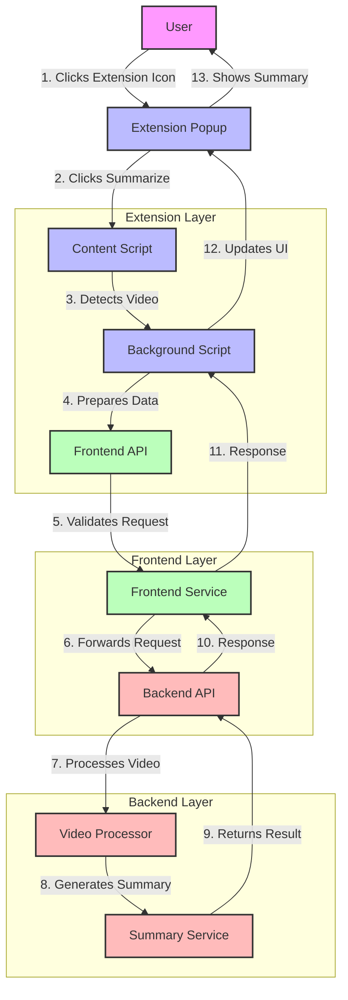

# Logical Data Flow

This document outlines the complete data flow when using the Secure Video Summarizer extension to process and summarize videos, with a specific focus on Olympus video integration.

## Overview

The application follows a three-tier architecture:
1. Browser Extension (Chrome)
2. Frontend Application (Port 8080)
3. Backend Service (Port 8081)



## Detailed Flow

### 1. Initial Detection
When a user visits a video page, the extension's content script automatically detects the video:

```javascript
// content.js detects the video
function findMainVideoElement() {
  // First, check if we're on the Olympus platform
  const platform = detectPlatform();
  if (platform === 'olympus') {
    console.log('Detected Olympus platform, looking for Olympus player...');
    const olympusVideo = findOlympusPlayer();
    if (olympusVideo) {
      isOlympusPlayer = true;
      return olympusVideo;
    }
  }
  // ... other video detection logic
}
```

### 2. User Interaction
1. User clicks the extension icon in their browser
2. Extension popup opens
3. User clicks "Summarize" button
4. Extension sends message to content script

### 3. Data Collection
The content script collects necessary video data:

```javascript
// content.js collects video data
chrome.runtime.sendMessage({
  action: "getCurrentVideo",
  data: {
    platform: 'olympus',
    videoId: videoElement.dataset.videoId,
    title: document.title,
    transcript: getOlympusTranscript(), // If available
    // ... other metadata
  }
});
```

### 4. Extension Processing
The background script processes the request and prepares it for the API:

```javascript
// background.js processes the request
chrome.runtime.onMessage.addListener((request, sender, sendResponse) => {
  if (request.action === "generateSummary") {
    // Prepare data for the API
    const apiData = {
      title: request.videoData.title,
      url: request.videoData.src,
      videoId: request.videoData.videoId,
      platform: 'olympus',
      options: {
        max_length: parseInt(request.options.length) || 150,
        min_length: 30,
        focus_key_points: request.options.focusKeyPoints || true,
        focus_details: request.options.focusDetails || false,
        format: request.options.format || 'paragraph'
      }
    };
    
    // Add platform-specific data
    if (request.videoData.transcript) {
      apiData.transcript = request.videoData.transcript;
    }
```

### 5. API Request Flow
The extension communicates with the frontend application:

```
Extension (background.js) → Frontend (8080)
POST /api/olympus/capture
{
  "title": "Video Title",
  "videoId": "123",
  "platform": "olympus",
  "transcript": "...",
  "options": {
    "max_length": 150,
    "format": "paragraph"
  }
}
```

### 6. Frontend Processing
The frontend receives the request and forwards it to the backend:

```javascript
// Frontend receives request on port 8080
// Forwards to backend on port 8081
fetch('http://localhost:8081/api/olympus/capture', {
  method: 'POST',
  headers: {
    'Content-Type': 'application/json',
  },
  body: JSON.stringify(apiData),
  credentials: 'include'
});
```

### 7. Backend Processing
The backend processes the request and generates the summary:

```python
# backend/app/api/olympus_routes.py
@olympus_bp.route('/capture', methods=['POST'])
def capture_olympus_video():
    data = request.get_json()
    video_id = data.get('videoId')
    transcript = data.get('transcript')
    
    # Process the video/summarize
    summary = generate_summary(transcript, data.get('options'))
    
    return jsonify({
        'success': True,
        'summary': summary,
        'metadata': {
            'videoId': video_id,
            'platform': 'olympus'
        }
    })
```

### 8. Response Flow
The processed data flows back to the user:

```
Backend (8081) → Frontend (8080) → Extension → Popup
```

### 9. User Interface Update
The extension popup receives and displays the summary:

```javascript
// Extension popup receives and displays the summary
chrome.runtime.onMessage.addListener((message) => {
  if (message.action === "transcriptionComplete") {
    // Update UI with summary
    displaySummary(message.data.summary);
  }
});
```

## Key Architecture Points

1. **Extension-Backend Communication**
   - Extension never communicates directly with backend
   - All communication goes through frontend (8080)
   - Frontend acts as a proxy to backend (8081)

2. **Security**
   - CORS is handled at both frontend and backend levels
   - Authentication/session management is handled by frontend
   - Secure communication between components

3. **Port Usage**
   - Frontend: Port 8080
   - Backend: Port 8081
   - Extension: No listening port (uses browser messaging)

4. **Data Flow Benefits**
   - Centralized authentication
   - Simplified CORS management
   - Better security through frontend proxy
   - Easier debugging and monitoring

## Error Handling

Each step in the flow includes error handling:
1. Video detection failures
2. Network communication errors
3. API processing errors
4. Authentication failures
5. Invalid data responses

## Security Considerations

1. **CORS Configuration**
   - Frontend allows requests from extension
   - Backend allows requests from frontend
   - No direct backend access from extension

2. **Authentication**
   - Session management through frontend
   - Token-based authentication
   - Secure cookie handling

3. **Data Protection**
   - HTTPS communication
   - Input validation
   - Output sanitization 